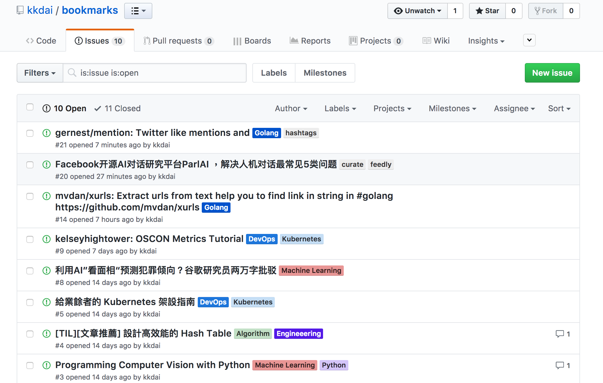
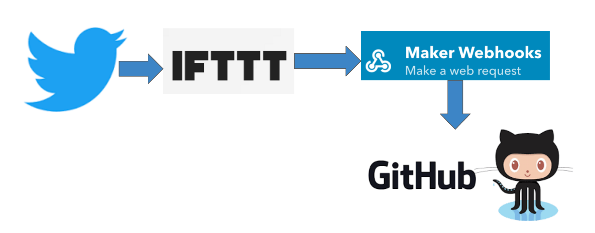
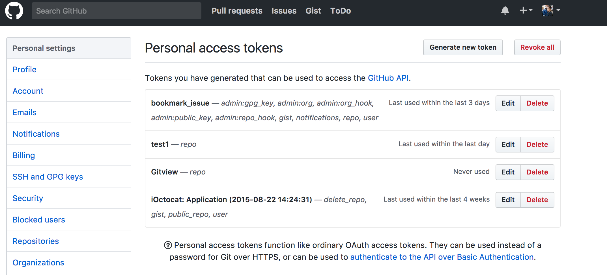

# bookmark-makerserver:  Using IFTTT to store your Tweet to Github Issue as bookmarks

 [](https://godoc.org/github.com/kkdai/bookmark-makerserver)  
 [](https://github.com/kkdai/bookmark-makerserver/actions/workflows/go.yml)



"Bookmark Maker Server" is a webhook service help you using [IFTTT](https://ifttt.com) to forward your tweet to your github issue as a bookmark. Result on [kkdai/bookmarks](https://github.com/kkdai/bookmarks), feel free to take a look.

The detail flow show as follow:



# How to use it?

Here is the step, how to use this without writing any code.

## Request your own github token for authorization

You need get your github token from [https://github.com/settings/tokens](https://github.com/settings/tokens)



## Duplicate your own makerserver by Heroku

Just press button to deploy your own.

[](https://heroku.com/deploy)

## How to setup on IFTTT

1. Request a account on [IFTTT Maker](https://ifttt.com/maker)

2. Create your own IFTTT Applet , using if "tweet by you" then call webmaker

3. In the maker server setup page, using following format.

- URL :  Your heroku app address
- Method: POST
- Content Type: application/json
- Body: Reference follow format

```json
{
  "User":"YOUR_GITHUB_USER_NAME", 
  "Repo":"YOUR_GITHUB_REPO_NAME", 
  "Msg": "{{Text}}"
}
```

That's it.

License
---------------

Licensed under the Apache License, Version 2.0 (the "License");
you may not use this file except in compliance with the License.
You may obtain a copy of the License at

<http://www.apache.org/licenses/LICENSE-2.0>

Unless required by applicable law or agreed to in writing, software
distributed under the License is distributed on an "AS IS" BASIS,
WITHOUT WARRANTIES OR CONDITIONS OF ANY KIND, either express or implied.
See the License for the specific language governing permissions and
limitations under the License.
